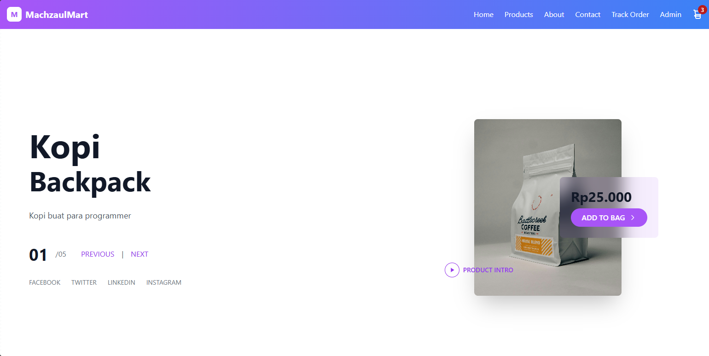
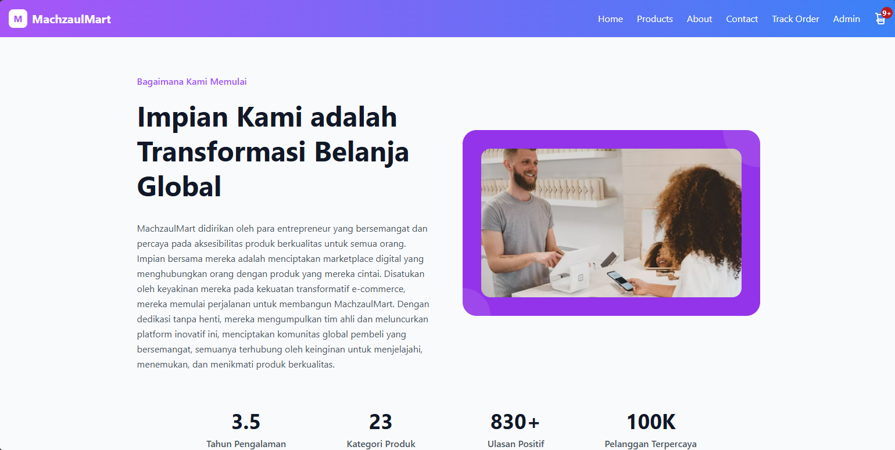
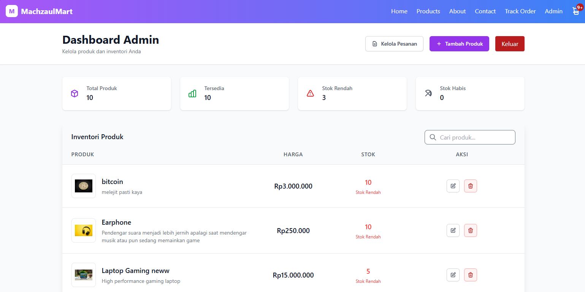
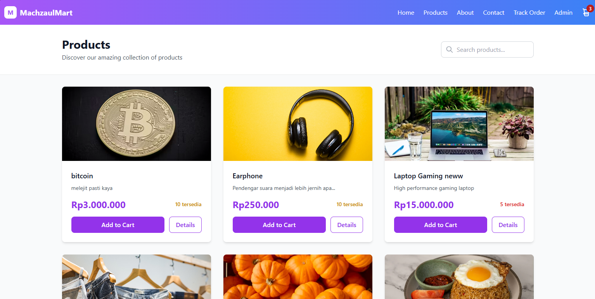
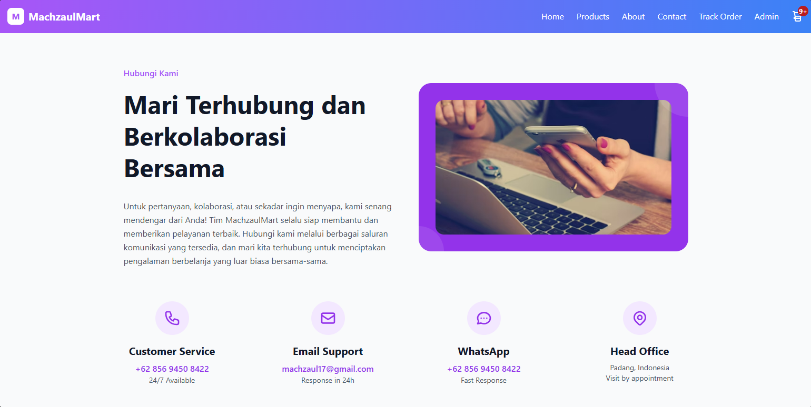
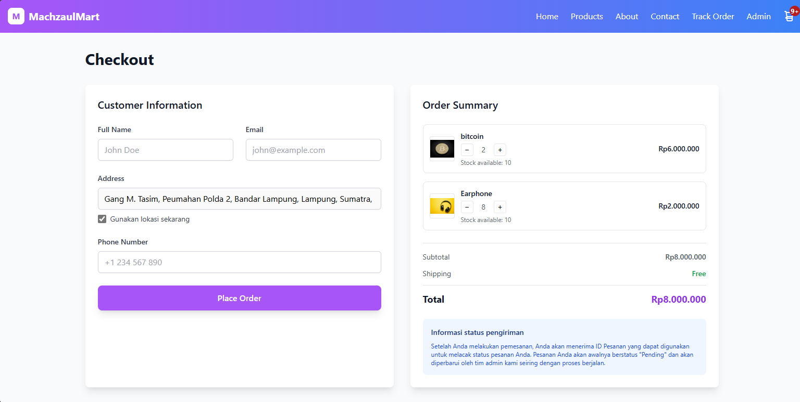
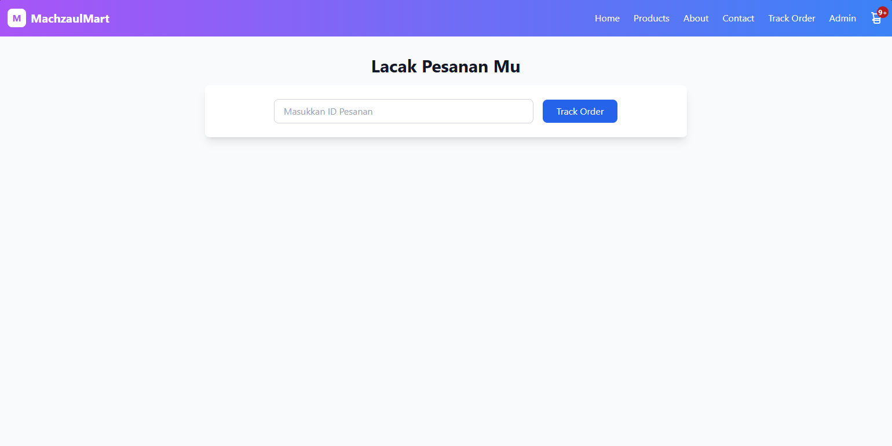
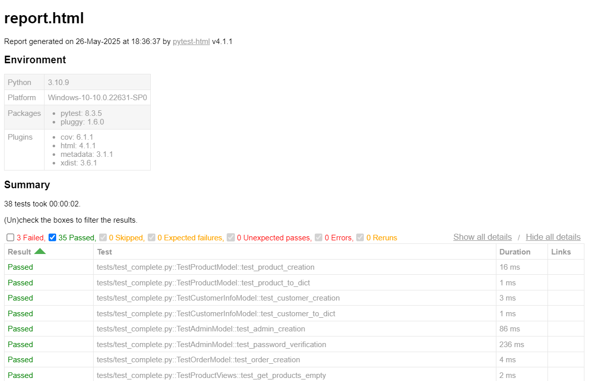

## markdown# MachzaulMart - E-commerce Platform
<p align="center">
  
</p>

<h1 align="center">🚀 Nama Proyek Kamu</h1>
<p align="center">
  <em>Aplikasi modern yang dibangun untuk menyelesaikan [tujuan atau masalah proyek].</em>
</p>

<p align="center">
  
  
  
</p>

---


MachzaulMart adalah platform e-commerce modern yang dibangun dengan teknologi terkini untuk memberikan pengalaman berbelanja online yang optimal. Platform ini menggabungkan antarmuka yang elegan dengan fungsionalitas yang lengkap untuk pengelolaan toko online.

## 🚀 Fitur Utama

- ✅ **Dashboard Admin** - Kelola produk, pesanan, dan inventori dengan mudah
- ✅ **Manajemen Pesanan** - Lacak status pesanan dari pending hingga completed
- ✅ **Sistem Checkout** - Proses pembayaran yang aman dan user-friendly
- ✅ **Manajemen Inventori** - Pantau stok produk secara real-time
- ✅ **Interface Responsif** - Tampilan yang optimal di semua perangkat
- ✅ **Pelacakan Pesanan** - Fitur tracking untuk pelanggan
- ✅ **Multi-kategori Produk** - Mendukung berbagai jenis produk
- ✅ **Notifikasi Real-time** - Update status pesanan secara langsung

## 🛠️ Tech Stack

### Frontend
├── React.js 18+           # UI Library
├── Tailwind CSS 3+        # Styling Framework
├── React Router v6        # Client-side Routing
├── Axios                  # HTTP Client
├── React Hooks            # State Management
└── Responsive Design      # Mobile-first Approach


### Backend
├── Python 3.8+            # Programming Language
├── Pyramid Framework      # Web Framework
├── SQLAlchemy            # ORM
├── Waitress              # WSGI Server
├── Alembic               # Database Migration
└── JWT Authentication    # Security


## 📋 Prerequisites

Pastikan sistem Anda telah terinstall:

-  **Node.js** (v16 atau lebih baru)
-  **npm** atau **yarn**
-  **Python** (v3.8 atau lebih baru)
-  **pip** (Python package installer)
-  **Git**

## 🔧 Installation

| Layer | Technology | Purpose |
|-------|------------|---------|
| **Backend** | Python Pyramid | RESTful API & Business Logic |
| **Frontend** | React + Tailwind CSS | User Interface |
| **Database** | SQLite/PostgreSQL | Data Storage |
| **Authentication** | JWT | Secure User Sessions |

## Quick Start

Get the project running locally in under 5 minutes:

```bash
# Clone repository
git clone https://github.com/machzaul/Tubes_Pemweb.git
cd "Tubes Pemweb"

# Start backend (Terminal 1)
cd Product_api
python -m venv venv
source venv/bin/activate  # Linux/macOS
# venv\Scripts\activate   # Windows
pip install -r requirements.txt
python setup.py develop
initialize_db development.ini
pserve development.ini --reload

# Start frontend (Terminal 2)
cd ../frontend
npm install
npm start
Access Points:

Frontend: http://localhost:3000
Backend API: http://localhost:6543

Installation
Prerequisites

Python 3.8+
Node.js 14+
PostgreSQL (for production)

Backend Setup
bashcd Product_api

# Create and activate virtual environment
python -m venv venv
source venv/bin/activate

# Install dependencies
pip install --upgrade pip
pip install -r requirements.txt

# Setup application
python setup.py develop
initialize_db development.ini

# Start development server
pserve development.ini --reload
Frontend Setup
bashcd FE_ecommerce

# Install dependencies
npm install

# Start development server
npm start
Project Structure
tubes-pemweb/
├── product_api/                 # Python Pyramid Backend
│   ├── product_api/
│   │   ├── models/             # Database Models
│   │   ├── views/              # API Controllers
│   │   ├── static/             # Static Assets
│   │   └── templates/          # HTML Templates
│   ├── requirements.txt        # Python Dependencies
│   ├── setup.py               # Package Configuration
│   └── development.ini        # Development Settings
│
├── FE_ecommerce/               # React Frontend
│   ├── public/                # Static Assets
│   ├── src/
│   │   ├── components/        # Reusable Components
│   │   ├── pages/             # Page Components
│   │   ├── services/          # API Integration
│   │   ├── utils/             # Helper Functions
│   │   └── styles/            # Styling
│   ├── package.json           # Node Dependencies
│   └── tailwind.config.js     # Tailwind Configuration
│
└── README.md                   # Documentation
Configuration
Backend Environment
Create .env in the product_api/ directory:
env# Database
DATABASE_URL=sqlite:///machzaulmart.db

# Security
SECRET_KEY=your-secret-key-here
JWT_SECRET=your-jwt-secret

# Application
DEBUG=True
CORS_ORIGINS=http://localhost:3000

# Email (Optional)
SMTP_HOST=smtp.gmail.com
SMTP_PORT=587
SMTP_USER=your-email@gmail.com
SMTP_PASS=your-password
Frontend Environment
Create .env in the FE_ecommerce/ directory:
env# API Configuration
REACT_APP_API_URL=http://localhost:6543
REACT_APP_API_VERSION=v1

# Application
REACT_APP_APP_NAME=MachzaulMart
REACT_APP_APP_VERSION=1.0.0
Dependencies
Backend Requirements:
txtpyramid==2.0.2
SQLAlchemy==1.4.46
pyramid-cors==2.0.0
pyramid-jwt==1.6.1
bcrypt==4.0.1
waitress==2.1.2
Frontend Dependencies:

React 18+
Tailwind CSS 3+
Axios for API calls
React Router for navigation

API Documentation
Authentication
bashPOST /api/auth/login
Content-Type: application/json

{
  "email": "admin",
  "password": "admin123"
}
Products Endpoints
MethodEndpointDescriptionAuthGET/api/productsList all productsNoGET/api/products/{id}Get product detailsNoPOST/api/productsCreate productAdminPUT/api/products/{id}Update productAdminDELETE/api/products/{id}Delete productAdmin
Orders Endpoints
MethodEndpointDescriptionAuthGET/api/ordersList ordersAdminGET/api/orders/{id}Get order detailsYesPOST/api/ordersCreate orderNoPUT/api/orders/{id}Update order statusAdmin
Sample Response
json{
  "id": 38,
  "orderId": "46998052-fperj7eh1",
  "customerInfo": {
    "id": 38,
    "fullName": "John Doe",
    "email": "john@example.com",
    "address": "123 Main Street",
    "phoneNumber": "+1234567890"
  },
  "items": [
    {
      "id": 55,
      "productId": 12,
      "product": {
        "id": 12,
        "title": "Premium Jeans",
        "description": "High-quality denim jeans",
        "price": 100000.0,
        "stock": 11
      },
      "quantity": 1,
      "price": 100000.0
    }
  ],
  "subtotal": 100000.0,
  "shipping": 0,
  "total": 100000.0,
  "status": "pending"
}
Development
Database Setup
SQLite (Development):
bashcd Product_api
source venv/bin/activate
initialize_db development.ini
PostgreSQL (Production):
bash# Install PostgreSQL
sudo apt-get install postgresql postgresql-contrib

# Create database
sudo -u postgres createdb machzaulmart

# Update DATABASE_URL in .env
Testing
Backend Tests:
bashcd Product_api
source venv/bin/activate
pip install pytest pytest-cov
python -m pytest tests/ -v
Frontend Tests:
bashcd FE_ecommerce
npm test
npm test -- --coverage --watchAll=false
Code Quality

Python: Follow PEP 8 standards
JavaScript: ESLint configuration included
Git: Use conventional commit messages
Documentation: Update README for major changes

Deployment
Production Build
Backend (Waitress):
bashcd Product_api
source venv/bin/activate
pip install waitress
waitress-serve --port=6543 --call product_api:main
Frontend (Static):
bashcd FE_ecommerce
npm run build
npm install -g serve
serve -s build -l 3000
Docker Deployment
dockerfile# Backend Dockerfile
FROM python:3.9-slim
WORKDIR /app
COPY Product_api/requirements.txt .
RUN pip install -r requirements.txt
COPY Product_api/ .
CMD ["waitress-serve", "--port=6543", "--call", "product_api:main"]
dockerfile# Frontend Dockerfile
FROM node:16-alpine as build
WORKDIR /app
COPY FE_ecommerce/package*.json ./
RUN npm install
COPY FE_ecommerce/ .
RUN npm run build

FROM nginx:alpine
COPY --from=build /app/build /usr/share/nginx/html
```
Contributing
We welcome contributions from the community. Please follow these steps:

Fork the repository
Create a feature branch: git checkout -b feature/new-feature
Make your changes and commit: git commit -m "Add new feature"
Push to your fork: git push origin feature/new-feature
Submit a pull request

Development Guidelines

Write clear, self-documenting code
Include tests for new features
Update documentation as needed
Follow existing code style and conventions

Troubleshooting
Common Issues
Backend Issues:

ModuleNotFoundError: Run python setup.py develop in backend directory
Database errors: Reinitialize with initialize_db development.ini
Port conflicts: Use different port with --port=6544

Frontend Issues:

npm install fails: Clear cache with npm cache clean --force
Tailwind not working: Verify tailwind.config.js configuration
CORS errors: Check backend CORS settings

Debug Mode
Enable debug logging by setting environment variables:
bash# Backend
export DEBUG=true

# Frontend
REACT_APP_LOG_LEVEL=debug npm start
Roadmap
Version 1.1 (Q3 2025)

Payment gateway integration
Real-time notifications
Advanced analytics
Mobile application

Version 1.2 (Q4 2025)

Multi-vendor marketplace
Inventory forecasting
Advanced search filters
Social media integration

Version 2.0 (2026)

AI-powered recommendations
Enhanced security features
International expansion tools
Advanced reporting suite

Support
For technical support and inquiries:

Email: machzaul17@gmail.com
Phone: +62 856 9450 8422
Location: Padang, Indonesia
Issues: GitHub Issues
Documentation: Wiki

Support Hours:

Customer Support: 24/7 response
Development Support: Monday-Friday, 9AM-5PM (WIB)

License
This project is licensed under the MIT License. See the LICENSE file for details.
MIT License

Copyright (c) 2025 MachzaulMart

Permission is hereby granted, free of charge, to any person obtaining a copy
of this software and associated documentation files (the "Software"), to deal
in the Software without restriction, including without limitation the rights
to use, copy, modify, merge, publish, distribute, sublicense, and/or sell
copies of the Software, and to permit persons to whom the Software is
furnished to do so, subject to the following conditions:

The above copyright notice and this permission notice shall be included in all
copies or substantial portions of the Software.
Acknowledgments
Special thanks to:

React Team - For the powerful JavaScript framework
Tailwind CSS Team - For the utility-first CSS framework
Pyramid Community - For the robust Python web framework
Open Source Community - For the incredible tools and libraries
Beta Testers - For valuable feedback and testing
Early Adopters - For trusting our platform


## Screenshot Aplikasi

| Halaman Home | Halaman About |
|:---:|:---:|
|  |  |

| Halaman Dashboard | Halaman Produk |
|:---:|:---:|
|  |  |

| Halaman Kontak | Halaman Checkout |
|:---:|:---:|
|  |  |

| Halaman Lacak |
|:---:|
|  |


## 📦 Unit Testing

Sebagai bagian dari proses pengembangan, kami telah melakukan **unit testing** untuk memastikan bahwa setiap fungsi berjalan sesuai dengan yang diharapkan.

### ✅ Hasil Unit Testing

Berikut ini adalah hasil dari unit testing yang telah dilakukan:



Gambar di atas menunjukkan bahwa semua pengujian berhasil dijalankan tanpa error atau kegagalan. Hal ini menandakan bahwa fungsi-fungsi utama pada aplikasi telah berjalan dengan baik pada tahap pengujian ini dan terdapat 3 failed saat menggunakan data dummy yang berbeda dengan type content.

---

> 📌 Catatan: Jika terjadi perubahan pada fitur atau fungsi utama, disarankan untuk menjalankan kembali unit test untuk memastikan kestabilan aplikasi tetap terjaga.


<div align="center">
🛍️ MachzaulMart - Transformasi Belanja Global
Dibuat dengan ❤️ oleh Tim MachzaulMart
🚀 Live Demo | 📚 Documentation | 🐛 Report Bug
</div>