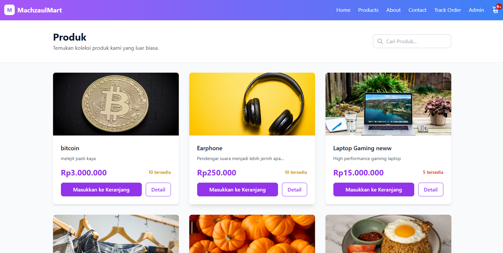

<p align="center">
  
</p>

<h1 align="center">MachzaulMart - E-commerce Platform</h1>
<p align="center">
  <em>Tinggal Klik, Langsung Datang!</em>
</p>


MachzaulMart adalah platform e-commerce modern yang dibangun dengan teknologi terkini untuk memberikan pengalaman berbelanja online yang optimal. Platform ini menggabungkan antarmuka yang elegan dengan fungsionalitas yang lengkap untuk pengelolaan toko online.

## 🚀 Fitur Utama

- ✅ **Dashboard Admin** - Kelola produk, pesanan, dan inventori dengan mudah
- ✅ **Manajemen Pesanan** - Lacak status pesanan dari pending hingga completed
- ✅ **Sistem Checkout** - Proses pembayaran yang aman dan user-friendly
- ✅ **Manajemen Inventori** - Pantau stok produk secara real-time
- ✅ **Interface Responsif** - Tampilan yang optimal di semua perangkat
- ✅ **Pelacakan Pesanan** - Fitur tracking untuk pelanggan
- ✅ **Multi-kategori Produk** - Mendukung berbagai jenis produk
- ✅ **Status Real time** - Update status pesanan secara langsung

## 🛠️ Tech Stack

### Frontend
├── React.js 18+           # UI Library
├── Tailwind CSS 3+        # Styling Framework
├── React Router v6        # Client-side Routing
├── Axios                  # HTTP Client
├── React Hooks            # State Management
└── Responsive Design      # Mobile-first Approach


### Backend
├── Python 3.8+            # Programming Language
├── Pyramid Framework      # Web Framework
├── SQLAlchemy            # ORM
├── Waitress              # WSGI Server
├── Alembic               # Database Migration
└── JWT Authentication    # Security


## 📋 Prerequisites

Pastikan sistem Anda telah terinstall:

-  **Node.js** (v16 atau lebih baru)
-  **npm** atau **yarn**
-  **Python** (v3.8 atau lebih baru)
-  **pip** (Python package installer)
-  **Git**

## 🔧 Installation

| Layer | Technology | Purpose |
|-------|------------|---------|
| **Backend** | Python Pyramid | RESTful API & Business Logic |
| **Frontend** | React + Tailwind CSS | User Interface |
| **Database** | SQLite/PostgreSQL | Data Storage |
| **Authentication** | JWT | Secure User Sessions |

## Dependensi Utama

Seluruh dependensi proyek didefinisikan di dalam file [`requirements.txt`](./requirements.txt). Berikut ini beberapa dependensi utama:

### Web Framework & Template Engine
- **`pyramid`** – Framework utama aplikasi.
- **`pyramid_jinja2`**, **`pyramid-mako`** – Engine template untuk rendering halaman (jika diperlukan).

### Database & ORM
- **`SQLAlchemy`** – ORM (Object Relational Mapper) untuk mengelola data dan query.
- **`psycopg2-binary`** – Driver PostgreSQL.
- **`zope.sqlalchemy`** – Integrasi SQLAlchemy dengan Pyramid transaction management.
- **`alembic`** – Untuk mengatur dan menjalankan migrasi skema database.

### Keamanan & Autentikasi
- **`PyJWT`** – JSON Web Token untuk autentikasi berbasis token.
- **`Werkzeug`** – Toolkit WSGI yang juga menyediakan utilitas keamanan (seperti password hashing).

### Alat Tambahan
- **`cookiecutter`** – Untuk membuat scaffold/template proyek dengan struktur yang terstandarisasi.

### WSGI Server
- **`waitress`** – WSGI server production-ready yang mudah dikonfigurasi dan cepat.

---

## Quick Start

Get the project running locally in under 5 minutes:

```bash
# Clone repository
git clone https://github.com/machzaul/Tubes_Pemweb.git
cd "Tubes Pemweb"

# Start backend (Terminal 1)
cd Product_api
python -m venv venv
source venv/bin/activate  # Linux/macOS
# venv\Scripts\activate   # Windows
pip install -r requirements.txt
python setup.py develop
initialize_db development.ini
pserve development.ini --reload

# Start frontend (Terminal 2)
cd ../frontend
npm install
npm start
Access Points:

Frontend: http://localhost:3000
Backend API: http://localhost:6543

Installation
Prerequisites

Python 3.8+
Node.js 14+
PostgreSQL (for production)

Backend Setup
bashcd Product_api

# Create and activate virtual environment
python -m venv venv
source venv/bin/activate

# Install dependencies
pip install --upgrade pip
pip install -r requirements.txt

# Setup application
python setup.py develop
initialize_db development.ini

# Start development server
pserve development.ini --reload
Frontend Setup
bashcd FE_ecommerce

# Install dependencies
npm install

# Start development server
npm start
Project Structure
tubes-pemweb/
├── product_api/                 # Python Pyramid Backend
│   ├── product_api/
│   │   ├── models/             # Database Models
│   │   ├── views/              # API Controllers
│   │   ├── static/             # Static Assets
│   │   └── templates/          # HTML Templates
│   ├── requirements.txt        # Python Dependencies
│   ├── setup.py               # Package Configuration
│   └── development.ini        # Development Settings
│
├── FE_ecommerce/               # React Frontend
│   ├── public/                # Static Assets
│   ├── src/
│   │   ├── components/        # Reusable Components
│   │   ├── pages/             # Page Components
│   │   ├── services/          # API Integration
│   │   ├── utils/             # Helper Functions
│   │   └── styles/            # Styling
│   ├── package.json           # Node Dependencies
│   └── tailwind.config.js     # Tailwind Configuration
│
└── README.md                   # Documentation
Configuration
Backend Environment
Create .env in the product_api/ directory:
env# Database
DATABASE_URL=sqlite:///machzaulmart.db

# Security
SECRET_KEY=your-secret-key-here
JWT_SECRET=your-jwt-secret

# Application
DEBUG=True
CORS_ORIGINS=http://localhost:3000

# Email (Optional)
SMTP_HOST=smtp.gmail.com
SMTP_PORT=587
SMTP_USER=your-email@gmail.com
SMTP_PASS=your-password
Frontend Environment
Create .env in the FE_ecommerce/ directory:
env# API Configuration
REACT_APP_API_URL=http://localhost:6543
REACT_APP_API_VERSION=v1

# Application
REACT_APP_APP_NAME=MachzaulMart
REACT_APP_APP_VERSION=1.0.0
Dependencies
Backend Requirements:
txtpyramid==2.0.2
SQLAlchemy==1.4.46
pyramid-cors==2.0.0
pyramid-jwt==1.6.1
bcrypt==4.0.1
waitress==2.1.2
Frontend Dependencies:

React 18+
Tailwind CSS 3+
Axios for API calls
React Router for navigation

API Documentation
Authentication
bashPOST /api/auth/login
Content-Type: application/json

{
  "email": "admin",
  "password": "admin123"
}
Products Endpoints
MethodEndpointDescriptionAuthGET/api/productsList all productsNoGET/api/products/{id}Get product detailsNoPOST/api/productsCreate productAdminPUT/api/products/{id}Update productAdminDELETE/api/products/{id}Delete productAdmin
Orders Endpoints
MethodEndpointDescriptionAuthGET/api/ordersList ordersAdminGET/api/orders/{id}Get order detailsYesPOST/api/ordersCreate orderNoPUT/api/orders/{id}Update order statusAdmin
Sample Response
json{
  "id": 38,
  "orderId": "46998052-fperj7eh1",
  "customerInfo": {
    "id": 38,
    "fullName": "John Doe",
    "email": "john@example.com",
    "address": "123 Main Street",
    "phoneNumber": "+1234567890"
  },
  "items": [
    {
      "id": 55,
      "productId": 12,
      "product": {
        "id": 12,
        "title": "Premium Jeans",
        "description": "High-quality denim jeans",
        "price": 100000.0,
        "stock": 11
      },
      "quantity": 1,
      "price": 100000.0
    }
  ],
  "subtotal": 100000.0,
  "shipping": 0,
  "total": 100000.0,
  "status": "pending"
}
Development
Database Setup
SQLite (Development):
bashcd Product_api
source venv/bin/activate
initialize_db development.ini
PostgreSQL (Production):
bash# Install PostgreSQL
sudo apt-get install postgresql postgresql-contrib

# Create database
sudo -u postgres createdb machzaulmart

# Update DATABASE_URL in .env
Testing
Backend Tests:
bashcd Product_api
source venv/bin/activate
pip install pytest pytest-cov
python -m pytest tests/ -v
Frontend Tests:
bashcd FE_ecommerce
npm test
npm test -- --coverage --watchAll=false
Code Quality

Python: Follow PEP 8 standards
JavaScript: ESLint configuration included
Git: Use conventional commit messages
Documentation: Update README for major changes

Deployment
Production Build
Backend (Waitress):
bashcd Product_api
source venv/bin/activate
pip install waitress
waitress-serve --port=6543 --call product_api:main
Frontend (Static):
bashcd FE_ecommerce
npm run build
npm install -g serve
serve -s build -l 3000
Docker Deployment
dockerfile# Backend Dockerfile
FROM python:3.9-slim
WORKDIR /app
COPY Product_api/requirements.txt .
RUN pip install -r requirements.txt
COPY Product_api/ .
CMD ["waitress-serve", "--port=6543", "--call", "product_api:main"]
dockerfile# Frontend Dockerfile
FROM node:16-alpine as build
WORKDIR /app
COPY FE_ecommerce/package*.json ./
RUN npm install
COPY FE_ecommerce/ .
RUN npm run build

FROM nginx:alpine
COPY --from=build /app/build /usr/share/nginx/html
```
<h2 align="center"> Contributing</h2>

Kami sangat menghargai kontribusi dari komunitas. Ikuti langkah-langkah berikut untuk berkontribusi:

<ol>
  <li>Fork repositori ini.</li>
  <li>Buat branch fitur baru:
    <pre><code>git checkout -b feature/nama-fitur</code></pre>
  </li>
  <li>Lakukan perubahan dan commit:
    <pre><code>git commit -m "Add nama fitur"</code></pre>
  </li>
  <li>Push ke fork Anda:
    <pre><code>git push origin feature/nama-fitur</code></pre>
  </li>
  <li>Buat pull request ke branch <code>main</code> di repositori utama.</li>
</ol>

---

<h2> Development Guidelines</h2>

<ul>
  <li>✅ Tulis kode yang jelas dan mudah dipahami.</li>
  <li>✅ Sertakan <strong>unit test</strong> untuk fitur baru.</li>
  <li>✅ Perbarui dokumentasi jika diperlukan.</li>
  <li>✅ Ikuti gaya dan konvensi penulisan kode yang sudah ada.</li>
</ul>

---

<h2> Troubleshooting</h2>

<h3> Masalah Umum</h3>

<strong>🔹 Backend</strong>

- <strong>ModuleNotFoundError</strong>  
  Jalankan:
  <pre><code>python setup.py develop</code></pre>

- <strong>Kesalahan database</strong>  
  Inisialisasi ulang dengan:
  <pre><code>initialize_db development.ini</code></pre>

- <strong>Konflik port</strong>  
  Jalankan dengan port lain:
  <pre><code>pserve development.ini --port=6544</code></pre>

<strong>🔹 Frontend</strong>

- <strong>npm install gagal</strong>  
  Bersihkan cache:
  <pre><code>npm cache clean --force</code></pre>

- <strong>Tailwind tidak berfungsi</strong>  
  Periksa file <code>tailwind.config.js</code>.

- <strong>CORS error</strong>  
  Pastikan backend memiliki konfigurasi CORS yang benar.

<h3> Debug Mode</h3>

<strong>Backend:</strong>
<pre><code>export DEBUG=true</code></pre>

<strong>Frontend:</strong>
<pre><code>REACT_APP_LOG_LEVEL=debug npm start</code></pre>

---

<h2>🗺️ Roadmap</h2>

<table>
  <thead>
    <tr>
      <th>Versi</th>
      <th>Fitur</th>
    </tr>
  </thead>
  <tbody>
    <tr>
      <td><strong>1.1 (Q3 2025)</strong></td>
      <td>
        🔌 Integrasi payment gateway<br/>
        🔔 Notifikasi real-time<br/>
        📊 Analitik lanjutan<br/>
        📱 Aplikasi mobile
      </td>
    </tr>
    <tr>
      <td><strong>1.2 (Q4 2025)</strong></td>
      <td>
        🛍️ Marketplace multi-vendor<br/>
        📦 Prediksi stok & inventory<br/>
        🔎 Filter pencarian lanjutan<br/>
        📣 Integrasi media sosial
      </td>
    </tr>
    <tr>
      <td><strong>2.0 (2026)</strong></td>
      <td>
        🤖 Rekomendasi berbasis AI<br/>
        🔐 Fitur keamanan tingkat lanjut<br/>
        🌍 Ekspansi internasional<br/>
        📈 Laporan bisnis canggih
      </td>
    </tr>
  </tbody>
</table>

---

<h2>📞 Support</h2>

📧 <strong>Email:</strong> <a href="mailto:machzaul17@gmail.com">machzaul17@gmail.com</a><br/>
📱 <strong>Telepon:</strong> +62 856 9450 8422<br/>
📍 <strong>Lokasi:</strong> Padang, Indonesia<br/>


## Screenshot Aplikasi

| Halaman Home | Halaman About |
|:---:|:---:|
|  |  |

| Halaman Dashboard | Halaman Produk |
|:---:|:---:|
|  |  |

| Halaman Kontak | Halaman Checkout |
|:---:|:---:|
|  |  |

| Halaman Lacak |
|:---:|
|  |


##  Unit Testing

Sebagai bagian dari proses pengembangan, kami telah melakukan **unit testing** untuk memastikan bahwa setiap fungsi berjalan sesuai dengan yang diharapkan.

###  Hasil Unit Testing

Berikut ini adalah hasil dari unit testing yang telah dilakukan:


Gambar di atas menunjukkan bahwa semua pengujian berhasil dijalankan tanpa error atau kegagalan. Hal ini menandakan bahwa fungsi-fungsi utama pada aplikasi telah berjalan dengan baik pada tahap pengujian ini dan terdapat 3 failed saat menggunakan data dummy yang berbeda dengan type content.

---


<div align="center">
🛍️ MachzaulMart - Transformasi Belanja Global
Dibuat oleh Machzaul Harmansyah
🚀 Live Demo | 📚 Documentation | 🐛 Report Bug
</div>